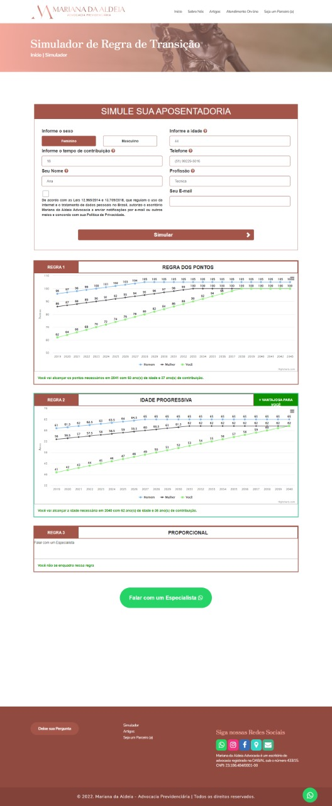

<p align="center"> 
   Simulador de aposentadoria
</p>

----



# Indice

- [Sobre](#-sobre)
- [Tecnologias](#Tecnologias)
- [Como instalar no projeto](#-como-instalar-no-projeto)

## 🔖&nbsp; Sobre

Projeto desenvolvido para o [Grupo VSB](https://webdesign.grupovsb.com/)

---
## Tecnologias

Esse projeto foi desenvolvido com as seguintes tecnologias:

- [PHP](https://www.php.net/manual/pt_BR/intro-whatis.php)
- [Wordpress](https://br.wordpress.com/)

---

## 🗂 Como instalar no projeto


* Necessário Wordpress instalado localmente. Colocar dentro da pasta do tema ativo do wordpress.
* Adicionar a linha de codigo dentro do arquivo no final em `functions.php` do tema ativo.

ˋˋˋphp

    require get_template_directory().'./sa_functions.php';
    
```

* Dentro do arquivo `sa_functions.php` na variavel `$theme_name` mencionar o nome do tema conforme encontrado no arquivo `functions.php` do tema ativo.
* Após isso basta ir no Painel administrativo do site > Aparencia > Personalizar > Simulador de aposentadoria e definir os parametros do simulador.

---

<h3 align="center" >Vamos nos conectar 😉</h3>
<p align="center">
  <a href="https://www.linkedin.com/in/filipeleonelbatista/">
    
  </a>&ensp;
  <a href="mailto:filipe.x2016@gmail.com">
    
  </a>&ensp;
  <a href="https://instagram.com/filipeleonelbatista">
    
  </a>
</p>
<br />
<p align="center">
    Desenvolvido 💜 por Filipe Batista 
</p>
